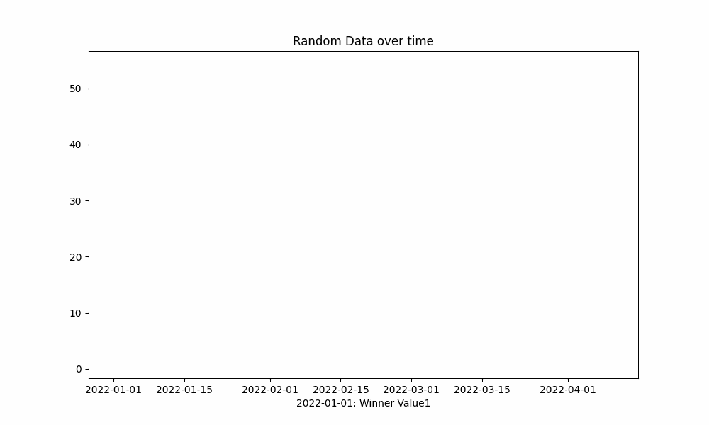

# Race line chart animation in matplotlib
This repository contains a Python script animated_line.py that demonstrates how to create an animated line chart using Matplotlib. The script generates random data and plots it over time, creating a dynamic visualization that updates frame by frame.

## Features

* Generates random data for two variables over a specified number of frames. 
* Creates an animated line chart that updates at a specified interval.
* Outputs the animation as a GIF.
* Can be adapted to output video files using FFmpeg.

## How it Works
The script begins by defining the number of frames and the interval between frames. It then generates a pandas DataFrame with random cumulative sums for two variables over the specified number of frames.

A Matplotlib figure and axes are created, and initial plots for the two variables are drawn. These plots are stored as line objects.

### Two functions are defined:

* `get_description_string(data: pd.DataFrame, idx: int) -> str`
:   This function returns a string that identifies the variable with the highest value at a given index.
* `update_ani_frame(frame_num: int, data_lines: List[plt.Line2D]) -> List[plt.Line2D]`:  This function updates the data for each line object for a given frame number.

## Usage
To run the script, simply execute python animated_line.py in your terminal.

Example output:  

### Requirements
Python 3.6+  
Matplotlib 
Pandas 
NumPy 

### Future Enhancements
* Add support for outputting video files using FFmpeg.
* Allow customization of the number of variables, number of frames, and interval between frames.
* Improve the get_description_string function to provide more detailed descriptions.

### Contributing
Pull requests are welcome.  For major changes, please open an issue first to discuss what you would like to change.
